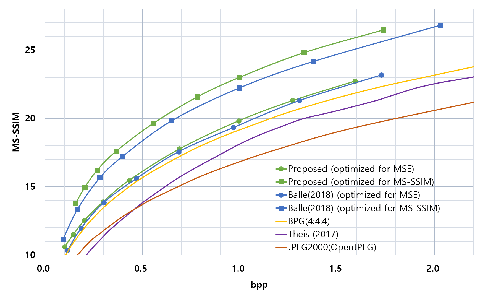

#  Context-adaptive Entropy Model for End-to-end Optimized Image Compression
Repository of the paper ["Context-adaptive Entropy Model for End-to-end Optimized Image Compression"](http://arxiv.org/abs/1809.10452)

## Introduction
This repository includes [evaluation results](https://github.com/JooyoungLeeETRI/CA_Entropy_Model/tree/master/Evaluation%20Results), [reconstructed images](https://github.com/JooyoungLeeETRI/CA_Entropy_Model/tree/master/Reconstructed%20images), and [test codes](./CA_EntropyModel_Test) of our paper ["Context-adaptive Entropy Model for End-to-end Optimized Image Compression"](http://arxiv.org/abs/1809.10452). Please refer to [the paper](http://arxiv.org/abs/1809.10452) for the detailed information.

## Reconstructed samples

## Evaluation results
We optimized the networks with the two different types of distortion terms, one with MSE and the other with MS-SSIM. For each distortion type, the average bits per pixel (BPP) and the distortion, PSNR or MS-SSIM, over 24 PNG images of the [Kodak PhotoCD image dataset](http://r0k.us/graphics/kodak/) are measured for each of the nine R-D configurations. Therefore, a total of 18 networks are trained and evaluated. To our best knowledge, this is the first test results of ANN-based image compression which outperform [BPG](https://bellard.org/bpg/), in terms of PSNR as well as MS-SSIM.

Followings are the rate-distortion curves of the proposed method and competitive methods. The top plot represents PSNR values in consequence of bpp changes, while the bottom plot shows MS-SSIM values in the same manner. Note that MS-SSIM values are converted to decibels for differentiating the quality levels. 

The compression gains in terms of BD-rate of PSNR over [JPEG2000](http://www.openjpeg.org/), [Balle'18(MSE-optimized)](https://arxiv.org/abs/1802.01436), [BPG](https://bellard.org/bpg/) are 34.08\%, 11.87\%, 6.85\%, respectively. In case of MS-SSIM, we found the wider gaps of 68.82\%, 13.93\%, 49.68\%, respectively.

## Test code
We provide [test codes](./CA_EntropyModel_Test) for evaluating a image compression model proposed in our work ["Context-adaptive Entropy Model for End-to-end Optimized Image Compression"](http://arxiv.org/abs/1809.10452). The model includes two types of models, base models for low bpp and hybrid models for high bpp.

### Supported I/O formats
Python Imaging Library (PIL) is used in our test code. To file the supported formats, please refer to https://pillow.readthedocs.io/en/4.1.x/handbook/image-file-formats.html. PNG and BMP formats including RGB channels have been tested.

### Encoding
* usage: 
encode.py [-h] [--model_type {0,1}] [--input_path INPUT_PATH]
                 [--compressed_file_path COMPRESSED_FILE_PATH]
                 [--quality_level {1,2,3,4,5,6,7,8,9}]

* optional arguments:
  --model_type {0,1}    	0: MSE optimized 1: MS-SSIM optimized
  --input_path 			input image path
  --compressed_file_path 	target compressed file path
  --quality_level {1,2,3,4,5,6,7,8,9}	quality level from 1 to 9. The higher, the better

* Sample command for encoding:
python encode.py --model_type 0 --input_path ./examples/input_example.png --compressed_file_path ./examples/output.cmp --quality_level 5

### Decoding
* usage: 
decode.py [-h] [--compressed_file_path COMPRESSED_FILE_PATH]
                 [--recon_path RECON_PATH]

* optional arguments:
  --compressed_file_path 	input compressed file path
  --recon_path 			target reconstructed image path

* Sample command for decoding:
python decode.py --compressed_file_path ./examples/output.cmp --recon_path ./examples/recon_example.png

## Notes
* When you first excute test codes, it may take a few minutes to download models. Please be patient.
* When HDF5 version error occurs during tests, please try to install HDF5 1.10.1. When you use anaconda environment, you can install it using the following command:
conda install -c anaconda hdf5=1.10.1
* Currently test codes spend most of time for arithmetic coding and decoding. We implemented the arithmetic coder that operates with the model parameter such as mu and sigma, based on [Nayuki's work](https://github.com/nayuki/Reference-arithmetic-coding). We really appreciate for her great effort. Note that, however, current the model-based arithmetic coder is not fully optimized. If anybody has any idea on it, please let us know.
* Note that the evaluation results in our [papaer](http://arxiv.org/abs/1809.10452) are not the first results that outperforms BPG. [David Minnen et al](https://arxiv.org/abs/1809.02736) showed that their model outperforms BPG, a bit earlier than us. We'll revise [Our manuscript](http://arxiv.org/abs/1809.10452) to correct it soon.
