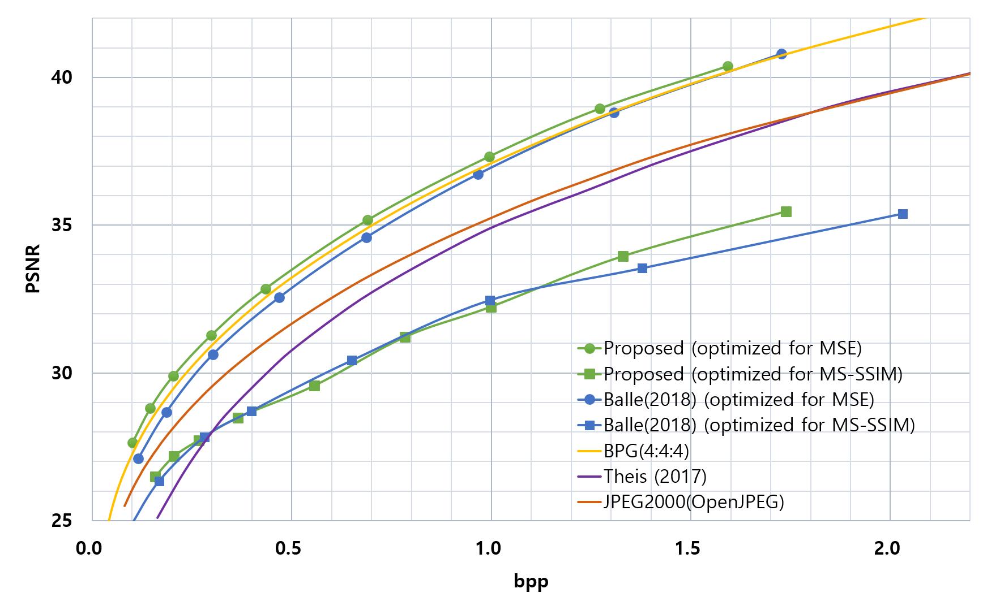

#  Context-adaptive Entropy Model for End-to-end Optimized Image Compression
Repository of the paper "Context-adaptive Entropy Model for End-to-end Optimized Image Compression"

## Introduction
This repository includes the evaluation results and the reconstructed images of our paper "Context-adaptive Entropy Model for End-to-end Optimized Image Compression"(). Please refer to our paper() for the detailed information.

## Reconstructed samples

## Evaluation results
We optimized the networks with the two different types of distortion terms, one with MSE and the other with MS-SSIM. For each distortion type, the average bits per pixel (BPP) and the distortion, PSNR or MS-SSIM, over 24 PNG images of the [Kodak PhotoCD image dataset](http://r0k.us/graphics/kodak/) are measured for each of the nine R-D configurations. Therefore, a total of 18 networks are trained and evaluated. To our best knowledge, this is the first test results of ANN-based image compression which outperform [BPG](https://bellard.org/bpg/), in terms of PSNR as well as MS-SSIM.

Followings are the rate-distortion curves of the proposed method and competitive methods. The top plot represents PSNR values in consequence of bpp changes, while the bottom plot shows MS-SSIM values in the same manner. Note that MS-SSIM values are converted to decibels for differentiating the quality levels. 

The compression gains in terms of BD-rate of PSNR over [JPEG2000](http://www.openjpeg.org/), [Balle'18(MSE-optimized)](https://arxiv.org/abs/1802.01436), [BPG](https://bellard.org/bpg/) are 34.08\%, 11.87\%, 6.85\%, respectively. In case of MS-SSIM, we found the wider gaps of 68.82\%, 13.93\%, 49.68\%, respectively.
